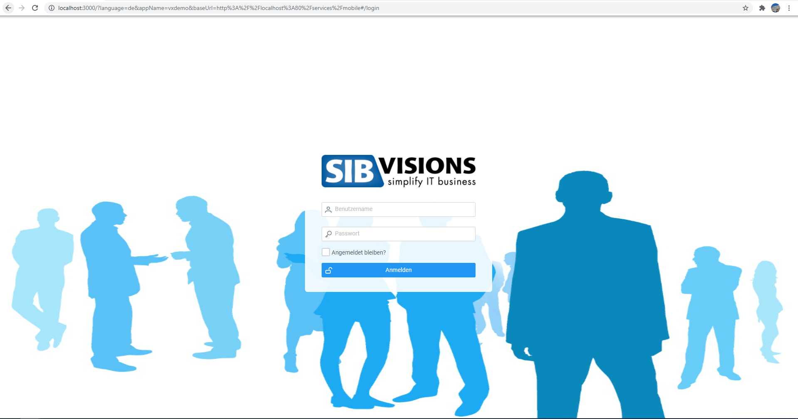

# JVx ReactUI Client
The JVx ReactUI Client is a web application for JVx applications. It is used to dynamically render work-screens, created with the JVx framework. All layouts of JVx are supported. The client has two different menu-layouts and a login mechanism. It is possible to either run the ReactUI as standalone web application or as library to create your own react-projects or to even embed it into an existing project.

# Requirements
- Node version: 12.1.0 or later
- Java version: 6 or later (for the JVx application)
- A JVx application, running on a Java application (Jetty, Tomcat, ...) server, using JVx mobile UI
- If you use ReactUI as lib you will need React 16.8.0 (for Hooks)

# Bundling
There are two options to use bundling with webpack.

    1. Production Bundle
        run ```npm run bundle``` to create a production bundle. URL configuration is then required in your app where reactUI is used as lib. Does not accept config.json!
    2. Development Bundle
        run ```npm run devbundle``` to create a development bundle. URL configuration is possible but config.json is also allowed.

# Getting Started
- Clone the git repository, open it in your development environment of choice and run ```npm install``` to download the dependencies.
- Run the command ```npm start``` to start reactUI. A new tab will open in your browser.
- If the web application can not connect to the server there are different approaches to fix this issue, Depending on whether you want to connect to the server by a config.json file or URL

    1. Config.JSON File
    
        Add a file called config.json in your public folder of your project. This file will be used to send the required data to the server during the startup-request. 
        
        Example:

        ```json
        {
            "appName": "[application name here]",
            "baseUrl": "[baseUrl here]",
            "username": "[username here]",
            "password": "[password here]",
            "deviceMode": "[deviceMode]",
            "language": "[language (en, de)]",
            "logoBig": "[path to logo in public directory]",
            "logoSmall": "[path to logo in public directory]",
            "logoLogin": "[path to logo in public directory]"
        }
        ```

    2. URL

        The parameters which are set in the config.json file, can also be set in the url, simply put the parameter after the first "/" of your url.

        Example:

        http://localhost:3000/?language=de&appName=vxdemo&baseUrl=http%3A%2F%2Flocalhost%3A80%2Fservices%2Fmobile/#

        You can see that parameters are the same names as in the config.json and are combined by a "&". The url gets prioritized over the config.json file, if you happen to have both of those options!
        
        It is also important to put a "#" after the last of your parameters, because we use the Hashrouter of ```react-router-dom```!!

If everything works out as planned, you will be redirected to the login:



After you logged in or if you have a valid username, password combination you will be redirected to home:


